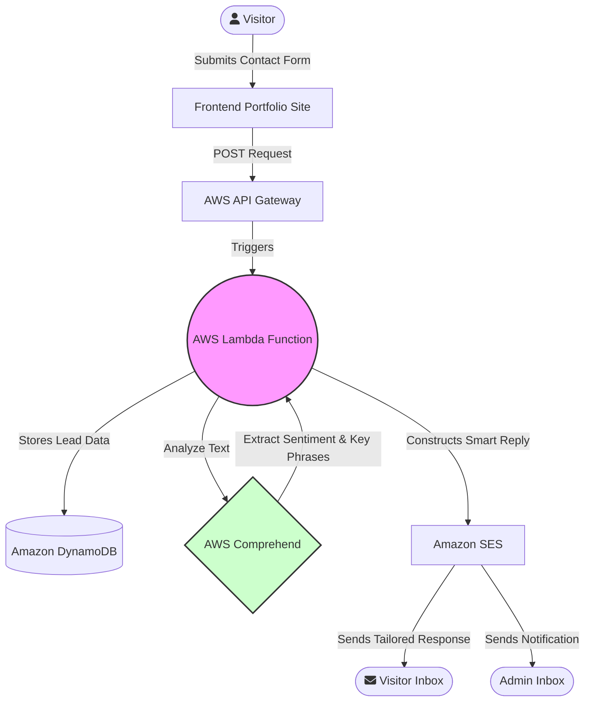

# Cloud Based Intelligent Portfolio

## Table of Contents
- [Overview](#overview)
- [Key Features](#key-features)
- [System Architecture](#system-architecture)
- [AI Pipeline Deep Dive](#ai-pipeline-deep-dive)
- [Technology Stack](#technology-stack)
- [Prerequisites](#prerequisites)
- [Deployment Overview](#deployment-overview)
- [Future Enhancements / Roadmap](#future-enhancements--roadmap)

---

## Overview

The **Cloud Based Intelligent Portfolio** is a serverless, highly-available professional website built to showcase data science, machine learning, and AI projects. What sets this portfolio apart is its integrated **Natural Language Processing (NLP) backend**. 

When a visitor—such as a potential recruiter or client—submits a message through the contact form, the serverless backend automatically processes the text. It determines the underlying sentiment and extracts key phrases, allowing the system to send an intelligent, mathematically-determined, and automated email response tailored to the visitor's specific inquiry.

## Key Features

*   **Zero-Server Maintenance**: The entire infrastructure is hosted using serverless technologies, resulting in high availability, auto-scaling, and lower costs.
*   **Intelligent Automation**: Utilizes AWS Comprehend to analyze user messages, categorizing sentiment (Positive, Negative, Neutral) and identifying core topics.
*   **Dynamic Response Engine**: Automatically constructs and sends personalized replies via AWS SES based on the AI analysis of the incoming message.
*   **Permanent Data Logging**: All inbound inquiries and system interactions are securely stored in a scalable NoSQL DynamoDB table for future review.
*   **Responsive UI**: A clean, accessible frontend built with HTML5, CSS3, and JavaScript that adapts to all screen sizes.

---

## System Architecture

The workflow is completely automated and event-driven via microservices:

---

## AI Pipeline Deep Dive

The true innovation in this project resides in the Lambda function. Here is an example of the AI logic in action:

**The Scenario:** A recruiter sends the following message: 
> *"I love your portfolio projects! Could you please forward me your CV as I have a job opportunity for you?"*

1.  **Sentiment Mapping**: The text is pushed to **AWS Comprehend**. The AI detects a highly `POSITIVE` emotional tone.
2.  **Keyword Extraction**: Comprehend identifies domain-specific keywords. In this case, it isolates the words `"CV"`, `"portfolio projects"`, and `"job opportunity"`.
3.  **Dynamic Response Resolution**: The python script running inside the AWS Lambda environment evaluates the data. Because sentiment is `POSITIVE` and the list of extracted keywords contains the string `"CV"`, the logic directs the flow to a specific response output.
4.  **Outcome**: AWS SES automatically emails the recruiter thanking them for their interest and natively linking to or attaching the resume, allowing for zero-latency communication.

---

## Technology Stack

### Frontend
*   **HTML5 / CSS3**: Core layout and styling design system.
*   **Vanilla JavaScript**: Handles client-side API requests asynchronously.

### Cloud Infrastructure (AWS)
*   **AWS Amplify**: Serves static web assets with a global CDN.
*   **Amazon API Gateway**: Acts as the "front door" proxy, securing the endpoint and forwarding POST requests.
*   **AWS Lambda (Python 3.x)**: The serverless compute layer orchestrating database writes, API calls, and evaluation logic.
*   **Amazon DynamoDB**: Scalable NoSQL storage for persisting interaction logs.
*   **Amazon Comprehend**: Managed NLP service extracting meaning, sentiment, and syntax without requiring custom ML model training.
*   **Amazon Simple Email Service (SES)**: Production-grade email routing for external and internal notifications.

---

## Prerequisites

If you wish to deploy this architecture, you will need:
- An active [AWS Account](https://aws.amazon.com/).
- Basic understanding of the AWS Management Console.
- A GitHub profile to fork and host the static files.

---

## Deployment Overview

> [!NOTE]  
> A highly detailed, step-by-step walkthrough is provided in the repository. Please reference [INSTRUCTIONS.md](./INSTRUCTIONS.md) to follow the complete deployment pipeline.

At a high level, deploying this project involves:
1.  **Frontend Generation**: Host the repository using AWS Amplify connected to your GitHub account.
2.  **Database Creation**: Provision a new DynamoDB table with a designated Primary Key.
3.  **Role Policies**: Configure an IAM Role allowing Lambda to write to DynamoDB, call Comprehend, and utilize SES.
4.  **Backend Deployment**: Write the central Python script inside AWS Lambda and attach the required execution roles.
5.  **API Bridging**: Generate an API Gateway REST endpoint, link it to the Lambda function, and paste the generated URL into the frontend javascript file (`contact_me.js`).

---

## Future Enhancements / Roadmap

- [ ] **AWS Lex Integration**: Implement a chatbot interface on the frontend for real-time text interactions.
- [ ] **AWS QuickSight**: Connect BI dashboards to the DynamoDB table to visualize traffic and engagement metrics over time.
- [ ] **Infrastructure as Code (IaC)**: Migrate manual AWS console setup to AWS CloudFormation or Terraform templates for one-click deployment.
